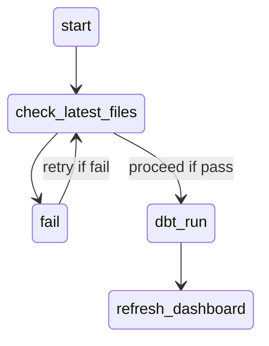
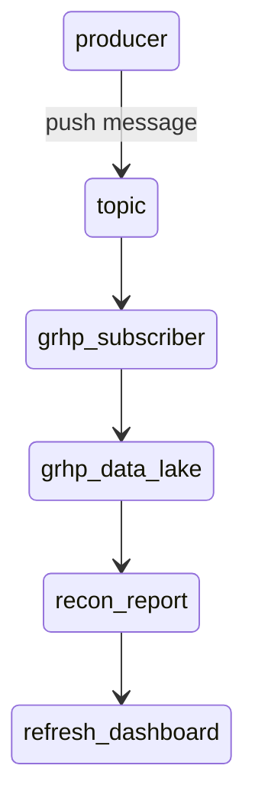

# GRHP Analytics Engineering Project

## Context
The company, GRHP, receives 2 reports after the stock market closes. These 2 reports are
- A trade report generated by an internal order management application
- A trade report generated by an external trading system

## Objectives
Provide a solution and design/implement a report to enable users to
1. Recap total trading quantity and total transactions per product
  - Show difference in total trading quantity and the number of transactions per product between internal and external reports
2. Highlight product containing mismatches across internal and external reports
  - Identify which source report contains mismatched transactions

## Exploratory Data Analysis
Before proceeding to build the tables for the reconciliation report, it is non-trivial to carry out an exploratory data analysis (EDA) on the 2 trade reports.
Details of the EDA can be found [here](https://colab.research.google.com/drive/16LkjCB7Z9lyzEE-uAMaVWN-PZgQHEm1s)

## Solution design
### Assumptions
1. Given that this scenario is likely a process that is carried out frequently, it should be assumed that the solution be automated by a set of tasks.
2. Mismatches are a cause for concern which could have significant implications if not remedied timely. It should be assumed that time-to-insights be minimal.

### Data transformation
The solution uses `dbt` as the data transformation tool to process raw data, the 2 reports in this case, and produce reliable and efficient reports.
Setup steps for local development of the dbt project can be found in the [grhp/setup](https://github.com/shaznishoffie/grhp-ae/tree/main/setup) directory.
Flow of data across the pipeline is shared in [grhp/README.md](https://github.com/shaznishoffie/grhp-ae/blob/main/grhp/README.md) where the `dbt` project is located.
It is worth noting that in a fully-automated solution, the dbt project would be scheduled to run at appropriate intervals within the day where the schedule
is managed by a scheduler such as Apache Airflow.

### Scalability
It is worth noting that in a fully-automated solution, the dbt project would be scheduled to run when the files are received. There are 2 general approaches available
to handle this requirement.

#### Batch processing
If the reports are received at fixed schedules within the day, it is possible to schedule the processing and transformation of the received reports using Apache Airflow.
Let's assume the reports are sent to a storage space such Google Cloud Storage at 5PM SGT. An Airflow DAG can be scheduled to run at 5PM SGT, starting with a task to check
the availability of the latest file. Once the check passes, the subsequent tasks would carry out the dbt transformations. Note that compute requirements should be tuned,
meaning that the transformation should be as optimised as possible and sufficient compute resources (BigQuery slot reservations) are made available to ensure the timely
delivery of the report.

#### Stream processing
To take a step further, processing millions of records using stream processing would enable near real-time reconciliation and consequently, quicker remedial actions for the
company.

