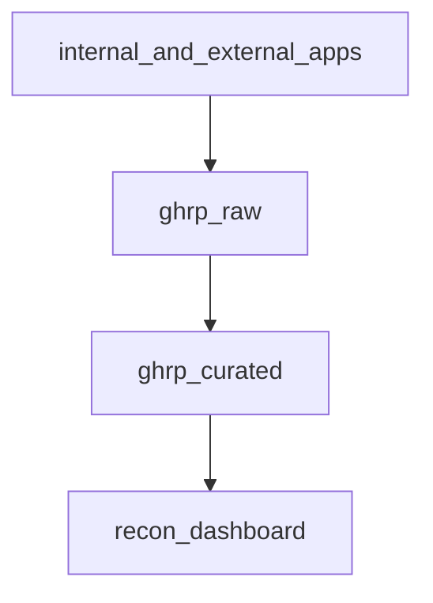

# GRHP dbt project
This dbt project transforms raw data located in GCP BQ dataset `thunder-1062.grhp_raw` into `thunder-1062.grhp_curated`.

## Data Layers
For simplicity, data is stored in 2 layers:
- raw data in `thunder-1062.grhp_raw`
- curated data in `thunder-1062.grhp_curated`

A simplified flow of data can be visually represented by the below graph

### Raw layer
The raw layer contains data that is sent from the source, both internal applications and external parties. Two CSV files
were provided for this case:
1. `ghp_ae_test_external_trade_report.csv`: Report from a third-party trading system
2. `ghp_ae_test_internal_trade_report.csv`: Report from an internal order management application

To simulate the ingestion of the above mentioned data and data ingestion is out-of-scope, the CSV files were directly
imported into the BQ dataset `thunder-1062.grhp_raw` via CSV upload. Additionally, since we are simulating a
reconciliation process that happens daily, we will add a date column `report_date` to the CSV files.

### Curated layer
Curated layer contains 2 types of data:
1. Staging data: Data from the raw layer with minimal transformation to ensure robustness to future upstream changes
2. Transformed data: Data that is transformed with heavier calculations and aggregations to enable analytics

### Dashboard report
The output of the transformation `trade_reconciliation_*` are used in a [Looker Studio](https://lookerstudio.google.com/reporting/07b974d7-33a7-4396-b59e-bca0fd67ae36) dashboard
where business teams can use to identify trades that are mismatched and subsequently take remedial action.
